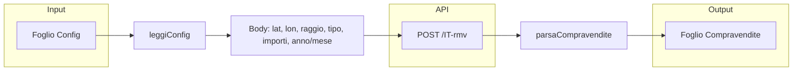
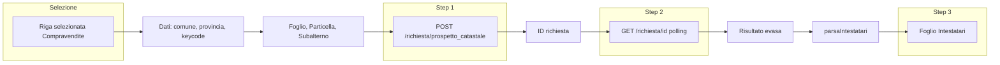

# Analisi repository e funzionamento del file .gs — Piano implementazione

## Struttura repository

La repository **BD_Private** contiene:

| File                                                                                        | Ruolo                                                                                       |
| ------------------------------------------------------------------------------------------- | ------------------------------------------------------------------------------------------- |
| [openapi_realestate_test.gs](c:\Github\BD_Private\openapi_realestate_test.gs)               | Script Google Apps Script per OpenAPI.it (Real Estate + Catasto)                            |
| [confronto-comune-vs-provincia.jsx](c:\Github\BD_Private\confronto-comune-vs-provincia.jsx) | App React standalone: confronto Comune vs Provincia (Milano/Pisa), griglia punti, costi API |
| [Link.txt](c:\Github\BD_Private\Link.txt)                                                   | URL del Google Sheet su cui viene usato lo script                                           |
| [README.md](c:\Github\BD_Private\README.md)                                                 | Solo titolo "# BD_Private"                                                                  |

Non ci sono `package.json`, `requirements.txt` o altri file di build: il .gs va incollato in un progetto Apps Script legato al foglio; il .jsx è un componente React da integrare in un progetto esistente.

---

## Funzionamento di `openapi_realestate_test.gs`

### Configurazione (righe 8–31)

- **CONFIG**: token Bearer sandbox, URL Real Estate (`https://test.realestate.openapi.com/IT-rmv`) e Catasto (`https://test.catasto.openapi.it`), nomi fogli, default (tipo immobile, raggio 20 km, importo min €3M, anno 2023), parametri di polling catasto (3 s, max 20 tentativi).
- **Token**: attualmente hardcoded; per produzione va esternalizzato (PropertiesService o foglio “Config” protetto).

### Menu e entry point (righe 37–50)

`onOpen()` crea il menu **"OpenAPI Real Estate"** con:

1. **Cerca Compravendite** → `cercaCompravendite()`
2. **Arricchisci con Catasto (riga selezionata)** → `arricchisciCatasto(riga?)`
3. **Ricerca Persona (CF + Provincia)** → `ricercaPersona()`
4. **Flusso Completo (1 + 2)** → `flussoCompleto()`
5. **Crea fogli di lavoro** → `setupFogli()`
6. **Test Real Estate** / **Test Catasto** → `testConnessione()`, `testCatasto()`

### Flusso 1: Cerca Compravendite (righe 144–243)

- Legge parametri da **Config** (`leggiConfig`): latitudine, longitudine, raggio, tipo immobile, importo min/max, anno/mese inizio/fine.
- Normalizza coordinate (virgola → punto) con `normalizzaCoordinata`.
- Chiama **POST** su `CONFIG.REALESTATE_URL` con `chiamaAPI("POST", url, body)` (header `Authorization: Bearer TOKEN`, `Content-Type: application/json`).
- Parsing: `parsaCompravendite(response)` gestisce struttura annidata `data[].data[].units[]` (o item senza units) e mappa in righe con prezzo, data, indirizzo, comune, provincia, keycode, superfici, coordinate, ecc.
- Scrive nel foglio **Compravendite** (header definito in `setupFogli`), formattazione prezzo in €.

### Flusso 2: Arricchisci con Catasto (righe 248–424)

- Riga: da parametro `arricchisciCatasto(rigaTarget)` o dalla riga attiva nel foglio Compravendite (altrimenti riga 2).
- Dati letti dalla riga: prezzo (B), comune (G), provincia (H), keycode (W). Per **foglio/particella/subalterno**:
  - Prova `parsaKeycode(keycode)` (in sandbox i keycode sono hash hex → spesso non parsabili).
  - Se mancanti, mostra **prompt** per inserimento manuale (es. "1, 100, 1" per sandbox).
- Provincia: `derivaCodiceProvincia(provincia)` (mappa nomi → sigle 2 lettere) o prompt.
- **Step 1**: POST a `CONFIG.CATASTO_URL + "/richiesta/prospetto_catastale"` con `tipo_catasto`, `provincia`, `comune`, `foglio`, `particella`, opzionale `subalterno`.
- **Step 2**: `pollRichiestaCatasto(id)` — GET ripetuta su `/richiesta/{id}` ogni 3 s fino a `stato === "evasa"` (max 20 tentativi).
- **Step 3**: `parsaIntestatari(...)` estrae `risultato.immobili[].intestatari` e scrive nel foglio **Intestatari** (riferimento riga compravendita, foglio/particella/subalterno, provincia, comune, categoria/classe/consistenza/rendita, intestatario, CF, tipo proprietà, quota, id richiesta, stato).

### Flusso 3: Ricerca Persona (righe 329–403)

- Parametri da Config (CF/P.IVA, Provincia, Tipo Catasto) o prompt.
- POST `CONFIG.CATASTO_URL + "/richiesta/ricerca_persona"` con `cf_piva`, `tipo_catasto`, `provincia`.
- Stesso polling `pollRichiestaCatasto(id)`.
- `parsaRicercaPersona(risultato)` → soggetti e immobili; scrive nel foglio **RicercaPersona** (cognome, nome, data/luogo nascita, CF, dati catasto/ubicazione, foglio/particella/subalterno, categoria, classe, consistenza, rendita).

### Flusso Completo (righe 409–421)

- Esegue `cercaCompravendite()` poi, dopo 1 s, `arricchisciCatasto(2)` sulla prima riga risultati. In sandbox arricchisce solo la prima compravendita.

### Helper principali

- **chiamaAPI(method, url, body)**: `UrlFetchApp.fetch` con Bearer, JSON; gestione 402 (credito), 428 (token/scope); ritorna oggetto parsato o null.
- **pollRichiestaCatasto(id)**: loop GET fino a stato "evasa" o "errore"/timeout.
- **leggiConfig(ss)**: legge righe 2–20 del foglio Config, mappa per nome (latitudine, longitudine, raggio, tipoImmobile, … cfPiva, provinciaPersona, tipoCatasto).
- **getOrCreateSheet(ss, name)**: restituisce foglio esistente o lo crea.
- **normalizzaCoordinata(val)**: stringa con virgola → punto; `derivaCodiceProvincia(t)**:** sigla 2 lettere da nome provincia.
- **parsaKeycode(keycode)**: se non è hash hex, prova split su `_/-|` per foglio/particella/subalterno (in sandbox spesso vuoto).

### Gestione errori

- Alert su token/credito (402/428), connessione, timeout polling, ID richiesta mancante, validazione foglio/particella.
- Log con `Logger.log` per debug (request body, response, stato polling).

---

## Relazione con `confronto-comune-vs-provincia.jsx`

- Il **.jsx** non chiama le API: è una **matrice di confronto** (Comune vs Provincia per Milano e Pisa) con griglia di punti, raggi (500 m–10 km), tipi immobile, query annuale/mensile, pricing OpenAPI e copertura %.
- Condivide la logica di dominio (IT-rmv, min_amount €3M, raggio max) e può essere usato per **stimare costi e numero di chiamate** prima di usare lo script .gs sul foglio.
- Per “implementare il progetto” si può: (a) usare solo il .gs sul Google Sheet; (b) integrare il .jsx in un’app React e eventualmente collegarla in futuro a un backend che replichi le chiamate OpenAPI; (c) tenere .gs e .jsx come strumenti separati ma coerenti.

---

## Come implementare il progetto

### 1. Utilizzo immediato dello script .gs

- Aprire il Google Sheet indicato in [Link.txt](c:\Github\BD_Private\Link.txt).
- In **Estensioni → Apps Script** creare un progetto e incollare l’intero contenuto di [openapi_realestate_test.gs](c:\Github\BD_Private\openapi_realestate_test.gs).
- Aggiornare `CONFIG.TOKEN` se il token sandbox cambia (o spostare il token in PropertiesService/Config).
- Salvare, eseguire **una volta** `setupFogli` dal menu per creare i fogli Compravendite, Intestatari, RicercaPersona, Config.
- Compilare il foglio **Config** (latitudine, longitudine, raggio, tipo immobile, importi, anno/mese; per ricerca persona: CF, Provincia, Tipo Catasto).
- Eseguire **Test Real Estate** e **Test Catasto** per verificare connessione e scope.
- Usare **Cerca Compravendite** per popolare Compravendite; selezionare una riga e **Arricchisci con Catasto** (inserendo foglio/particella/subalterno se richiesto); oppure **Ricerca Persona** per CF+provincia.

### 2. Esternalizzare il token e la configurazione

- Salvare il token in **PropertiesService.getScriptProperties().setProperty('OPENAPI_TOKEN', '...')** e leggerlo in `CONFIG` (o da Config sheet con cella protetta).
- Evitare di committare token in chiaro nel repo: usare un placeholder in `CONFIG.TOKEN` e documentare in README dove configurarlo.

### 3. Miglioramenti opzionali allo script

- **Keycode**: in sandbox i keycode sono hash; in produzione, se l’API fornisce foglio/particella/subalterno in campi dedicati, mapparli direttamente senza dipendere da `parsaKeycode`.
- **Flusso completo**: opzione per arricchire **tutte** le righe di Compravendite (con ritardo tra una richiesta e l’altra per non superare limiti API).
- **Errori 402/428**: messaggi già presenti; eventualmente log su foglio “Log” per audit.
- **Config**: validazione tipo/range (es. lat/lon, anno) prima della chiamata.

### 4. Integrazione del componente React (.jsx)

- Se vuoi un’app web per la matrice di confronto: creare un progetto React (es. `create-react-app` o Vite), copiare il componente da [confronto-comune-vs-provincia.jsx](c:\Github\BD_Private\confronto-comune-vs-provincia.jsx) e adattare gli import (es. `export default` già presente).
- I dati AREAS, RADII, PRICING sono inline; per riuso potresti estrarli in un modulo `constants.js` o caricarli da config.
- L’app non sostituisce il .gs: il .gs resta l’implementazione che effettua le chiamate da Google Sheet; il .jsx è per pianificazione costi/copertura.

### 5. Documentazione (README)

- Descrivere in [README.md](c:\Github\BD_Private\README.md): scopo del repo, come collegare lo script al Google Sheet (e dove mettere il token), elenco voci menu e flussi (Compravendite → Catasto → Intestatari; Ricerca Persona), ruolo del file .jsx (strumento di confronto costi/comuni vs province), e link alla documentazione OpenAPI.it se utile.

---

## Riepilogo punti critici per il funzionamento

| Aspetto           | Stato / Nota                                                                           |
| ----------------- | -------------------------------------------------------------------------------------- |
| Token             | Hardcoded; per produzione esternalizzare e non committare                              |
| Sandbox           | URL test.realestate / test.catasto; per produzione usare URL produzione OpenAPI        |
| Keycode → catasto | In sandbox spesso non parsabile; necessario input manuale foglio/particella/subalterno |
| Config            | Ordine righe in Config deve rispettare `leggiConfig` (mapping per indice)              |
| Polling catasto   | 3 s × 20 = max 60 s attesa; aumentare `POLL_MAX_ATTEMPTS` se le richieste sono lente   |
| Limiti API        | Raggio max 20 km; rispettare rate limit tra chiamate in flussi batch                   |

Implementare il progetto significa quindi: (1) collegare e configurare il .gs sul Google Sheet e usare il menu per i tre flussi; (2) eventualmente esternalizzare token e migliorare robustezza; (3) opzionale integrare il .jsx in un’app React per la pianificazione; (4) aggiornare il README con le istruzioni sopra.