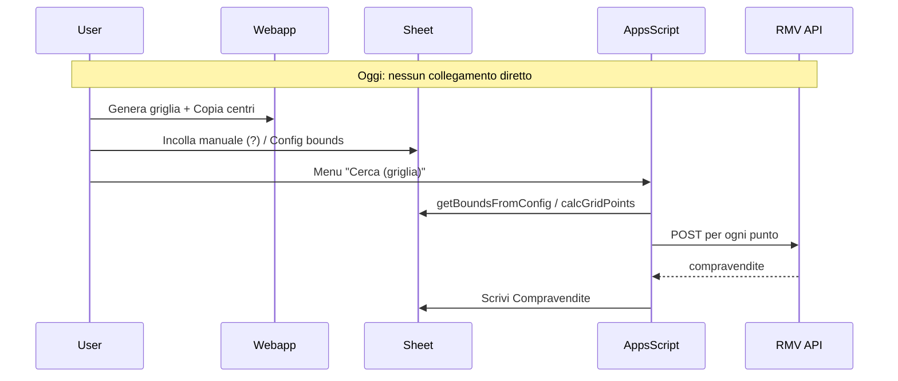

# Integrazione ricerca mappa → risultati in Google Sheet

## Obiettivo

Non perdere i dati una volta ricercati: tutti i risultati delle chiamate API RMV (per la griglia generata dalla mappa) devono essere salvati nel foglio **Compravendite** del Google Sheet, che diventa l’unica fonte di verità in produzione.

## Situazione attuale

- **Webapp GIS** ([webapp-gis/src/App.jsx](c:\Github\BD_Private\webapp-gis\src\App.jsx)): genera la griglia di centri (lat/lng) e raggio in km; pulsante "Copia centri (lat/lng per API)" copia un JSON `[{ longitude, latitude }, ...]`.
- **Apps Script** ([openapi_realestate_test.gs](c:\Github\BD_Private\openapi_realestate_test.gs)): `cercaCompravenditeGriglia()` legge i bounds dal foglio Config (o aree predefinite), calcola i punti con `calcGridPoints(bounds, raggio, 0.7)`, chiama l’API per ogni punto, deduplica per keycode e scrive nel foglio Compravendite. Non accetta oggi una lista di centri generata dalla mappa.

## Architettura target

Due modalità complementari:

1. **Da foglio (senza deploy Web App)**
  L’utente incolla nella webapp il JSON dei centri in una cella/foglio; un nuovo comando menu legge quella griglia, usa il raggio (da Config o dalla stessa richiesta) e esegue le chiamate scrivendo in Compravendite.
2. **Da webapp (un click)**
  La webapp invia in POST la griglia a uno script deployato come Web App; lo script esegue le stesse chiamate e scrive in Compravendite, poi risponde con un riepilogo (numero chiamate, numero compravendite, costo stimato). In produzione i dati restano solo nel Sheet.

---

## Piano di implementazione

### 1. Apps Script: accettare griglia “esterna” e scrivere in Compravendite

**File:** [openapi_realestate_test.gs](c:\Github\BD_Private\openapi_realestate_test.gs)

- **Nuova funzione `cercaCompravenditeGrigliaDaLista(points, radiusM)`**  
  - `points`: array di `{ lat, lng }` (o `{ latitude, longitude }` normalizzati).  
  - `radiusM`: raggio in metri (50–20000).  
  - Logica identica a `cercaCompravenditeGriglia()`: per ogni punto costruire il body con `bodyRicercaFromParams(params, lat, lng)` usando `params` da `leggiConfig(ss)` e **sovrascrivere** `params.raggio` con `radiusM`. Chiamare l’API, deduplicare per keycode, scrivere le righe nel foglio Compravendite (stesso formato colonne di oggi).  
  - Ritorno: `{ numChiamate, numCompravendite, costoStimato }` per uso da menu e da Web App.
- **Riuso:**  
  - Estrarre la logica “loop punti → API → deduplica → build rows” in una funzione interna (es. `eseguiGrigliaRMV(points, paramsOverride)`), chiamata sia da `cercaCompravenditeGriglia()` (che continua a usare `getBoundsFromConfig` + `calcGridPoints`) sia da `cercaCompravenditeGrigliaDaLista(points, radiusM)`.

### 2. Apps Script: menu “Cerca con griglia da mappa” (flusso da foglio)

**File:** [openapi_realestate_test.gs](c:\Github\BD_Private\openapi_realestate_test.gs)

- **Foglio Config:**  
  - Aggiungere in Config (es. righe dedicate o nuova sezione) un’area per “Griglia da mappa”:  
    - una cella (es. “JSON Griglia”) dove l’utente incolla il JSON copiato dalla webapp (`[{ "longitude": ..., "latitude": ... }, ...]`),  
    - oppure una cella “Raggio (m) griglia mappa” (se si vuole raggio solo da Config).
  - In alternativa: foglio dedicato **“GrigliaMappa”** con colonne `Latitudine`, `Longitudine` e opzionale `Raggio (m)` (una riga per centro; prima riga intestazione). Così si può anche incollare da “Copia centri” dopo aver convertito in tabella (o uno script che parsa il JSON dalla cella A1).
- **Scelta consigliata:**  
  - Cella unica in Config: “JSON centri (da webapp)” (es. B20) e “Raggio m griglia mappa” (es. B21).  
  - Nuova voce menu: **“Cerca Compravendite (griglia da mappa)”**.  
  - Alla chiamata: leggere `leggiConfig(ss)`, prendere il JSON dalla cella configurata, parsare `JSON.parse()`, normalizzare in `[{ lat, lng }]` (da `latitude/longitude`), leggere il raggio dalla cella (o default CONFIG.DEFAULT_RADIUS). Validare (centri array, raggio 50–20000). Chiamare `cercaCompravenditeGrigliaDaLista(points, radiusM)`. Mostrare alert con esito (chiamate, compravendite, costo) e conferma che i dati sono nel foglio Compravendite.
- **Gestione errori:**  
  - JSON non valido o cella vuota → messaggio chiaro “Incolla il JSON dei centri dalla webapp nella cella …”.

### 3. Apps Script: endpoint Web App per la webapp (flusso “un click”)

**File:** [openapi_realestate_test.gs](c:\Github\BD_Private\openapi_realestate_test.gs)

- **Funzione `doPost(e)`**  
  - Leggere il body: `e.postData.contents` (JSON).  
  - Payload atteso:  
    - `centers`: array di `{ latitude, longitude }` (come già prodotto dalla webapp).  
    - `search_radius_m`: numero (metri, 50–20000).
  - Opzionali (per allinearsi a Config): `property_type`, `min_amount`, `max_amount`, `start_year`, ecc. Se assenti, usare `leggiConfig(ss)`.  
  - **Sicurezza:**  
    - Token condiviso: in Script Properties una chiave `WEBAPP_TOKEN`; nel body o header (es. `X-WebApp-Token`) verificare che sia uguale. Se assente/diverso → risposta 401 JSON `{ success: false, message: "Unauthorized" }`.
  - Validazione: `centers` array non vuoto, lunghezza ragionevole (es. max 5000 per evitare abusi), `search_radius_m` in [50, 20000].  
  - Convertire `centers` in `points = centers.map(c => ({ lat: c.latitude, lng: c.longitude }))`.  
  - Chiamare la stessa logica di `cercaCompravenditeGrigliaDaLista(points, search_radius_m)` (o `eseguiGrigliaRMV` con override raggio).  
  - Risposta: `ContentService.createTextOutput(JSON.stringify({ success: true, numChiamate, numCompravendite, costoStimato, message: "Risultati salvati nel foglio Compravendite" })).setMimeType(ContentService.MimeType.JSON)`.  
  - In caso di errore: `success: false`, `message` con dettaglio, status 200 comunque (Apps Script non permette status code custom facili) per semplificare il parsing lato webapp.
- **Deploy:**  
  - Istruzioni in README: “Eseguzione” come “Me”, “Chi può accedere” “Solo chi ha il link” (o “Tutti” se si usa solo il token). Copiare l’URL della Web App per configurarlo nella webapp.

### 4. Webapp: pulsante “Salva ricerca in Google Sheet”

**File:** [webapp-gis/src/App.jsx](c:\Github\BD_Private\webapp-gis\src\App.jsx)

- **Stato / configurazione:**  
  - URL Web App: configurabile tramite variabile d’ambiente (es. `VITE_GOOGLE_SCRIPT_URL`) o input in una modale/sidebar (salvato in `localStorage`), così in produzione non si hardcoda l’URL.  
  - Token: stesso approccio (env `VITE_WEBAPP_TOKEN` o input una tantum, salvato in `localStorage`).
- **Pulsante:**  
  - Posizione: nel pannello destro, sotto “Copia centri (lat/lng per API)” o accanto a “Genera griglia cerchi”, visibile quando `gridCenters.length > 0`.  
  - Label: “Esegui ricerca e salva in Google Sheet” (o “Invia griglia a Google Sheet”).
- **Flusso al click:**  
  1. Se manca URL (e non c’è in env): mostrare modale/campo per inserire “URL Web App Apps Script” e opzionalmente “Token”, poi salvare in `localStorage`.
  2. Payload:
    - `centers`: `gridCenters.map(([lng, lat]) => ({ longitude: lng, latitude: lat }))` (come già per Copia).  
    - `search_radius_m`: `Math.round(searchRadiusKm * 1000)`.
  3. `fetch(webAppUrl, { method: 'POST', headers: { 'Content-Type': 'application/json', 'X-WebApp-Token': token }, body: JSON.stringify(payload) })`.
  4. Gestione risposta: se `success === true`, mostrare messaggio di successo con “Risultati salvati nel foglio Compravendite” e numero di compravendite/chiamate; se possibile, link al foglio (URL del spreadsheet + `#gid=<id foglio Compravendite>` se si conosce l’id). In caso di errore (401, 500, o `success: false`) mostrare messaggio chiaro.
- **UX:**  
  - Durante la richiesta: disabilitare il pulsante e mostrare “Invio in corso…” (le chiamate API possono richiedere tempo).  
  - Timeout: impostare un timeout ragionevole (es. 5–10 minuti per griglie grandi) e avvisare l’utente che per aree grandi l’operazione può durare a lungo.

### 5. Documentazione e produzione

**File:** [README.md](c:\Github\BD_Private\README.md) (o doc interna)

- Descrivere i due flussi:  
  - **Solo Sheet:** copia centri dalla webapp → incolla in Config (o GrigliaMappa) → menu “Cerca Compravendite (griglia da mappa)” → risultati in Compravendite.  
  - **Webapp → Sheet:** configurare URL e token (env o prima esecuzione) → “Esegui ricerca e salva in Google Sheet” → risultati in Compravendite.
- Checklist produzione:  
  - Token Web App impostato in Script Properties e (se usato) in env della webapp.  
  - Web App deployata con “Eseguzione come” = utente che possiede il Sheet; “Chi può accedere” scelto in base alla policy (solo link + token è un buon compromesso).  
  - Verificare che il foglio Compravendite sia quello usato per archiviare i dati e che non venga cancellato da altri flussi senza backup.

---

## Riepilogo dati e sicurezza

- **Dove restano i dati:** sempre nel foglio **Compravendite** del Google Sheet; la webapp non memorizza risultati, solo invia la griglia allo script.  
- **Token:** un solo segreto (Script Properties + stesso valore in webapp) per autorizzare le POST alla Web App.  
- **Limiti:** validazione lunghezza massima della griglia (es. 5000 centri) in `doPost` per evitare timeout e abusi.

## Ordine di implementazione suggerito

1. Refactor in Apps Script: estrarre `eseguiGrigliaRMV(points, paramsOverride)` e implementare `cercaCompravenditeGrigliaDaLista(points, radiusM)`.
2. Aggiungere in Config le celle per JSON griglia e raggio; voce menu “Cerca Compravendite (griglia da mappa)” che legge e chiama `cercaCompravenditeGrigliaDaLista`.
3. Implementare `doPost`, deploy Web App e test con Postman/curl.
4. In webapp: pulsante, configurazione URL/token e `fetch` con gestione risposta e messaggi.
5. Aggiornare README con i due flussi e la checklist produzione.

